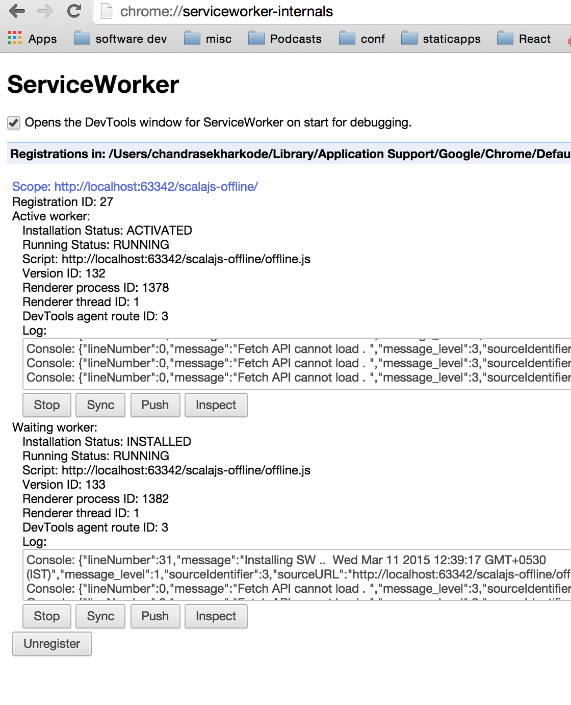

# scalajs-offline

####why offline apps ? 

 Internet - The World of **Uncertainty!** , don't believe me ?
 
 

 
 
[The Uncertain Future of the Internet](http://energycommerce.house.gov/hearing/the-uncertain-future-of-the-internet)
 
 Mobile Internet.
 
 I was interested in offline apps for none of the reasons mentioned above, 
 this is where i'm coding these days :)
 
 
 
[Some times its good to test what our little brain can do in isolation](https://www.flickr.com/photos/131773244@N04/16773951235/)

 enough stories? ,ok back to business ..
 
###What is a ServiceWorker :
 
ServiceWorker is a background worker, it gives us a JavaScript context to add features such as push messaging, background sync, geofencing and network control.

In terms of network control, it acts like a proxy server sitting on the client, you get to decide what to do on a request-by-request basis. You can use this to make stuff work faster, offline, or build new features.

[Introduction to Service Worker](http://www.html5rocks.com/en/tutorials/service-worker/introduction/)

[Using ServiceWorker in Chrome today](http://jakearchibald.com/2014/using-serviceworker-today/)

[A simple ServiceWorker app](http://blog.lamplightdev.com/2015/01/06/A-Simple-ServiceWorker-App/)

[The ServiceWorker: The network layer is yours to own](https://www.youtube.com/watch?v=4uQMl7mFB6g)
 
[Google I/O 2014 - Bridging the gap between the web and apps](https://www.youtube.com/watch?v=_yy0CDLnhMA) 

enough theory ? , ok back to real business ..
 
###Registration
  
```scala

 @JSExport
   override def main(): Unit = {
     React.render(AppRouter.C(), dom.document.getElementById("container"))
     if(!js.isUndefined(dom.navigator.serviceWorker)){ 
       dom.navigator.serviceWorker.register("/scalajs-offline/offline.js").andThen((resp: ServiceWorkerRegistration) => {
         println(s" ServiceWorker registered successfully : ${JSON.stringify(resp)}")
       }
       ).catchErr((err: Any) => println(s"service worker failed ${err}")) 
     } else {
       println("ServiceWorker not there yet!")
     }
   }
   
 ```

 On first load of our page, it'll render normally .But in background serviceWorker will be registered!
 
 1) First we check if browser support serviceWorker or not 
 
 2) If serviceWorker Supported then we'll register using ServiceWorkerContainer register method
 
 ```scala
   def register(scriptURL : String,options : js.UndefOr[js.Object] = js.undefined) : Promise[ServiceWorkerRegistration] = js.native

 ```
 the method will take two args 
  - scriptURL - the URL for service script (this is where all magic happens) 
  - options (optional settings) 
    - scope - A unique identifier for a service worker registration; this is usually a relative URL. Defaults to '/' when not present.
     example = { scope : "/scalajs-offline/" } - now our script only captures requests that bound to path scalajs-offline instead whole domain.

3) If registration successfull ,serviceWorker enters next life cycle **install**
###Install
 From now onwards we'll be looking code from offine.js

```javascript
    var projectDir = "/scalajs-offline"
    // Include SW cache polyfill  this script will be downloaded and cached by default
    importScripts(projectDir+"/js/serviceworker-cache-polyfill.js");
    //version
    var version = "0.0.8"
    // Cache name definitions
    var cacheNameStatic = "scalajs-offline-"+version;
    var cacheNameGithub = "scalajs-offline-github";
    var currentCacheNames = [
        cacheNameStatic,
        cacheNameGithub
    ];
    // A new ServiceWorker has been registered
    self.addEventListener("install", function (event) {
        event.waitUntil(
            caches.open(cacheNameStatic)
                .then(function (cache) {
                    return cache.addAll([
                        projectDir+"/",
                        projectDir+"/js/scalajs-offline-opt.js",
                        projectDir+"/js/scalajs-offline-jsdeps.js"
                    ]);
                })
        );
    });

```
 ServiceWorker comes with its own cache API , but its not implemented in browsers yet . Thanks to polyfills!
 
In this stage we'll cache all our static assets that are needed to make our app work offline.Please note that this operation is **atomic** , meaning it'll be successfull only if all resources downloaded and cached otherwise it will fail silently.If installation successfull then serviceWorker enters next life cycle **activate**

###Activate

```js
  // New service worker installed ( now you can safely perform deleting/migrating old cache)
    self.addEventListener("activate", function (event) {
        event.waitUntil(
            caches.keys()
                .then(function (cacheNames) {
                    return Promise.all(
                        cacheNames.map(function (cacheName) {
                            if (currentCacheNames.indexOf(cacheName) === -1) {
                                return caches.delete(cacheName);
                            }
                        })
                    );
                })
        );
    });
```    
In this stage we'll perform cleanup of old caches(if any) . after this our serviceWorker finally activated!.

You can check this in chrome using 
``chrome://serviceworker-internals/``


Ok now you're happy man!,want to shut this computer and enjoy cool breeze outisde!.Well it's not over yet bud, keep follow along with me ..

At this point serviceWorker activated but it's not controlling our page yet, meaning all  network requests from our app still not in control of serviceWorker they directly hitting the world of uncertainty(The Internet).

To check whether our page is controlled by serviceworker or not type this in Dev Tools console  
``navigator.serviceWorker.controller`` It retuns *null* if SW not controlling our page (which is true in our case)

The page won't be controlled by this worker until the next navigate(or refresh). Now  refresh our page and check ``navigator.serviceWorker.controller`` again 


hola , now our app is controlled by SW. to make sure check out network tab


all our assets are downloaded from serviceworker not internet!

to take control of network requests we can use serviceWorker  **fetch** life cycle.

###Fetch

```js
   // when a network request made from app
    self.addEventListener("fetch", function (event) {
        var requestURL = new URL(event.request.url);
        if (requestURL.hostname.indexOf(".github.com") > -1) {
           event.respondWith(githubAPIResponse(event.request))
        } else {
            event.respondWith(
                caches.match(event.request)
                    .then(function (response) {
                        if (response) {  // if we cached already just send that response back
                            return response;
                        }
                        var fetchRequest = event.request.clone();
                        return fetch(fetchRequest).then( // if not cached get from network return it and then cache it
                            function (response) {
                                var shouldCache = false;
                                if (response.type === "basic" && response.status === 200) {
                                    shouldCache = cacheNameStatic;
                                }
                                if (shouldCache) {
                                    var responseToCache = response.clone();
                                    caches.open(shouldCache)
                                        .then(function (cache) {
                                            var cacheRequest = event.request.clone();
                                            cache.put(cacheRequest, responseToCache);
                                        });
                                }
                                return response;
                            }
                        );
                    })
            );
        }
    });
```

ServiceWorker comes with the new shiny **[fetch api](https://developer.mozilla.org/en-US/docs/Web/API/Fetch_API)** to fetch resources across network.
Our scalajs-offline app makes only two type of network request 1) static resources from our domain 2) github api call to get scalajs repos.

Static Resource Network Requests :
   When app requested for a new static resource ,it'll hit service worker fetch event.Here we first check if its in cache or not. If its in cache then we'll send response directly from cache , if not then we request that resource using new **fetch api**  once its finished  we'll cache it and return the response.

Github API call :

```js
  function githubAPIResponse(request) {
      if (request.headers.get('Accept') == 'x-cache/only') {
          return caches.match(request).then(function(response) {
              return response;
          });
      } else {
          return fetch(request.clone()).then(function(response) {
              if(response.type === 200 ) { // only cache successful responses , as github supports CORS we can check status of response for non supported cors origins we'll get opaque response
                  return caches.open(cacheNameGithub).then(function(cache) {
                      cache.put(request,response.clone())
                      return response;
                  }); 
              } else {
                  return response;
              }
              
          });
      }
  }  
  ```

We'll repeat the same process as above , but this time we'll store cache in ``cacheNameGithub``.

to check caches info open a new tab then type ``chrome://serviceworker-internals/`` now click on inspect a new DevTools window will be open! go to resouces tab and then expand Servie Worker Cache


Feth API Response types 


>**Basic** - a response from a resource hosted on our domain. We have access to all of the response including full headers. For example our index page, CSS and JavaScript.

>**CORS** - a response from an external domain that supports CORS. Again full access to the response is available.

>**Opaque** - a response from any other source. In this case we use this for both the wikipedia api calls and the typekit calls that don’t support CORS, and the wikipedia images. The issue with opaque responses is that we don’t get access to the full response so we can’t tell the status of it. Successful responses (status 200) and error responses (statuses in the 400s and 500s) can’t be distinguished between so we might cache an error response. There’s not much that can be done in this case apart from wait for wider support for CORS.


**Thats it , you successfully created first offline App!. Sorry for stopping you before , now go out enjoy cool breeze :).Take your app with you if you want ,its offline app afterall!.**

###Updating App :

Enjoyed nature out there ha! , To update our app we must change offline.js file.

Let say if we updated our app code(some core logic!) then  incremented version number in offline.js and  deployed our code. Now when user navigated to our app 

1) New offline.js file will be downloaded and it'll byte compared with old file , check will return true and serviceWorker try to installs new version.



2) New worker will not be activated until current tab closed(or hard refreshed shift+refresh), meaning all network requests handled by old service worker.

3) Once we close our existing tab and navigate to our app the new service worker will be activated and old one will be killed.


4) In new worker activate phase we'll clean up all old caches.
   


 
